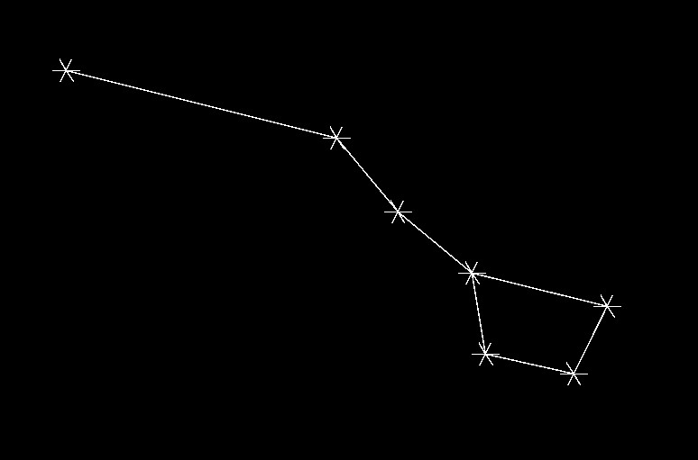

# The Constellation Project

**I AM AWARE THAT I SHOULDN'T USE THE JACKSON API. I'LL REMOVE IT WHEN I REFACTOR THE CODE**

## Project Requirements:
The Constellation Project loads constellations from datafiles (text files). The program then draws these constellations on screen. There is one datafile per "night sky" i.e. the program only loads one datafile. Each datafile contains a set of constellations. Each constellation gets a unique name and a set of stars. Each star has an id, location, size, color, and list of other stars that it is connected to. A completed constellation may look like this:

## Some caveats:
- There may be data duplication if the datafiles say that star A is connected to star B and star B is connected to star A. This is acceptable because it's not your fault; it's the fault of the person providing the datafile. Having data duplication for any other reason is unacceptable.
- You don't have to implement anything with the names of the constellations provided in the datafiles. **Extra credit if you include the names of the constellations near the constellations on the window**

## The datafiles:
The datafiles will follow a predetermined format. The format is as follows: A new constellation starts with a name in quotes. Every new line after that describes a star. Each parameter is seperated by commas in this format: star-id,x-coordinate,y-coordinate,size,color-in-hex,[list-of-connected-stars]. "!!!" denotes the start of a new constellation. Here's an example:
```
!!!"Big Dipper"
0,100,400,10,"#FFFF00",[1 3]
1,100,100,50,"#FFFFFF",[]
2,0,100,64,"#FFFFFF",[]
3,100,0,128,"#FFFFFF",[]

!!!"Canon Maranda"
0,0,0,100,"#FFFF00",[1 3]
1,100,100,50,"#FFFFFF",[]
2,0,100,64,"#FFFFFF",[]
3,100,0,128,"#FFFFFF",[]
```